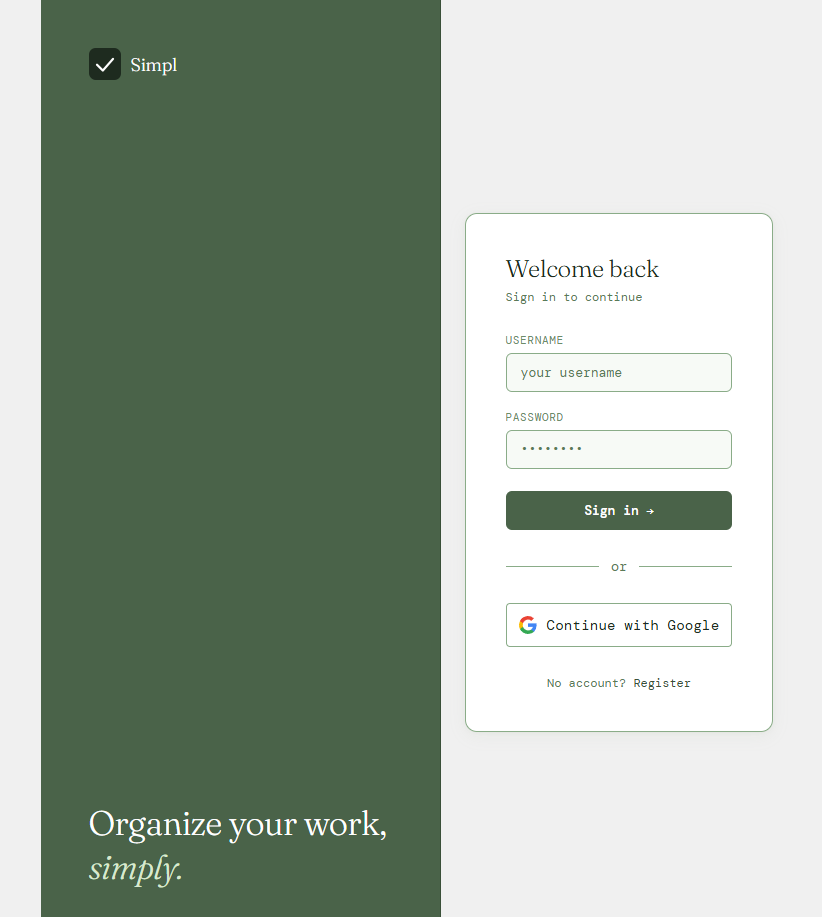
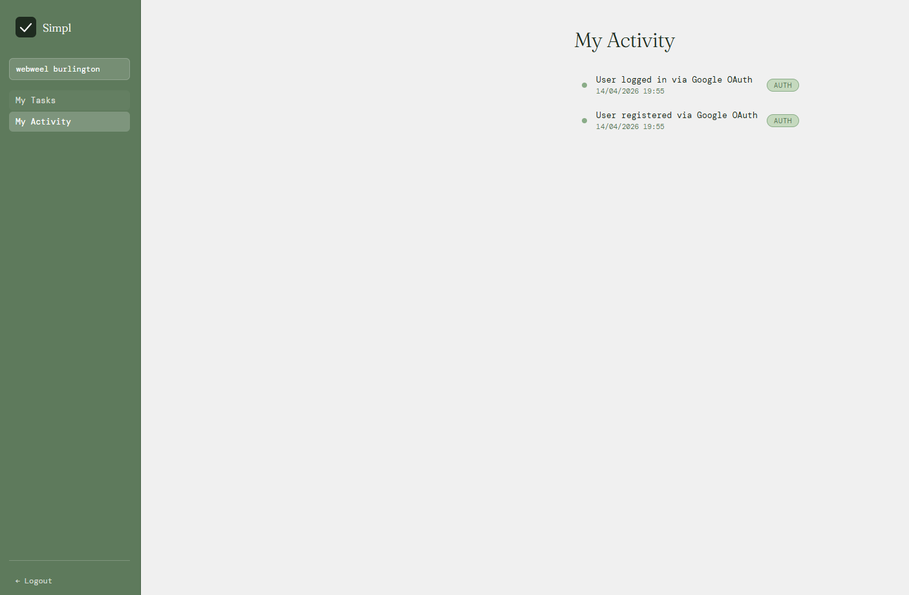
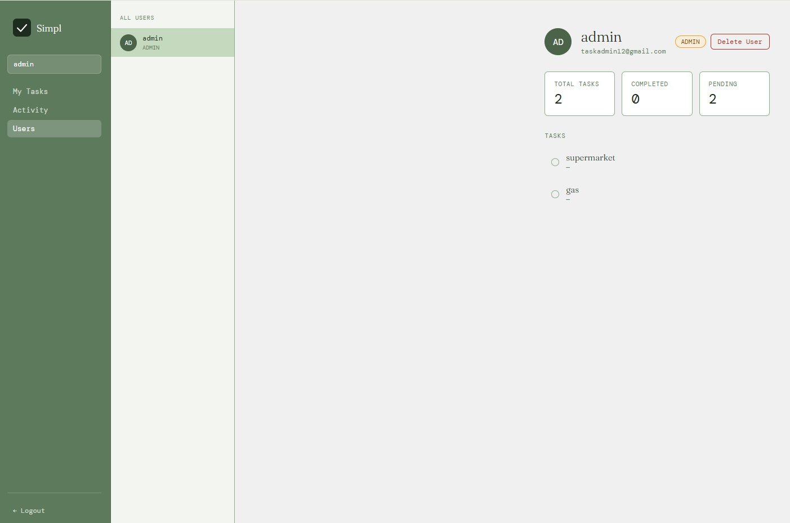

[README.md](https://github.com/user-attachments/files/26658561/README.md)
# simpl

A clean, full-stack task management application built with Node.js, Express, Angular 19, and MySQL.

---

## Overview

simpl is a personal task manager with real-time notifications, role-based access control, activity logging, and Google OAuth support. It was built as a learning project to explore full-stack architecture, WebSockets, JWT authentication, and Angular for the first time.

---

## Screenshots

| Login | Tasks |
|-------|-------|
|  |  |

| Activity Log | Admin Panel |
|-------------|-------------|
|  |  |

---

## Tech Stack

**Backend**
- Node.js / Express
- MySQL2
- JWT (access token + refresh token)
- Passport.js + Google OAuth 2.0
- socket.io
- nodemailer
- bcrypt, express-rate-limit

**Frontend**
- Angular 19 (standalone components)
- socket.io-client
- HttpClient with auth interceptor

**Deployment**
- Backend: [Render](https://render.com)
- Database: [Railway](https://railway.app)
- Frontend: [Vercel](https://vercel.com)

---

## Features

- Register and login with email/password or Google OAuth
- Create, edit, complete, and delete tasks and subtasks
- Real-time toast notifications via WebSockets
- Email notifications on every CRUD action
- Activity log per user
- Admin panel to manage users, tasks, and subtasks
- Role-based access control (USER / ADMIN)
- JWT auth with auto-refresh on expiry
- Rate limiting on auth endpoints

---

## Database Schema

```sql
users     — id, username, password, email, role, refreshToken, created_at
tasks     — id, user_id, title, description, is_completed, created_at, updated_at
subtasks  — id, task_id, user_id, title, description, is_completed, created_at
logs      — id, user_id, action, activity_type, created_at
```

---

## Getting Started

### Prerequisites

- Node.js v18+
- MySQL database
- Google Cloud OAuth credentials (optional)
- Gmail app password for nodemailer

### Backend

```bash
cd backend
npm install
```

Create a `.env` file:

```env
PORT=3000
DB_HOST=your_db_host
DB_USER=your_db_user
DB_PASSWORD=your_db_password
DB_NAME=your_db_name

ACCESS_TOKEN_SECRET=your_access_secret
REFRESH_TOKEN_SECRET=your_refresh_secret

EMAIL_USER=your@gmail.com
EMAIL_PASS=your_google_app_password
ADMIN_EMAIL=admin@gmail.com
ADMIN_USER_ID=1

GOOGLE_CLIENT_ID=your_google_client_id
GOOGLE_CLIENT_SECRET=your_google_client_secret
GOOGLE_CALLBACK_URL=http://localhost:3000/api/auth/google/callback
FRONTEND_URL=http://localhost:4200

NODE_ENV=development
```

```bash
npm run start:all  # runs backend + frontend concurrently
```

### Frontend

```bash
cd frontend/task-manager-frontend
npm install
ng serve
```

For production build:

```bash
ng build  # uses environment.prod.ts automatically
```

---

## Project Structure

```
simpl/
├── backend/
│   ├── controllers/        # Auth, user actions, admin, OAuth
│   ├── middleware/         # verifyJWT, verifyRole, rateLimiter
│   ├── routes/             # todolistRoutes, oAuthRoutes
│   ├── src/config/         # database.js
│   ├── mailer.js           # nodemailer templates
│   ├── passport.js         # Google OAuth strategy
│   └── server.js
└── frontend/
    └── task-manager-frontend/
        └── src/app/
            ├── pages/      # login, register, tasks, logs, admin
            ├── services/   # task, auth, admin, socket
            └── interceptors/
```

---

## Auth Flow

```
Login → POST /api/login
      → Access token (1h) stored in localStorage
      → Refresh token (1d) stored in httpOnly cookie

On 403 → Interceptor calls GET /api/refresh
        → New access token stored
        → Original request retried

Google OAuth → GET /api/auth/google
             → Redirect to Google
             → Callback → token issued → redirect to /oauth-callback
             → Frontend stores token → redirect to /tasks
```

---

## API Routes

| Method | Route | Access |
|--------|-------|--------|
| POST | `/api/signup` | Public |
| POST | `/api/login` | Public (rate limited) |
| GET | `/api/refresh` | Public |
| POST | `/api/logout` | Public |
| GET | `/api/tasks` | User |
| POST | `/api/tasks` | User |
| DELETE | `/api/tasks/:id` | User |
| PATCH | `/api/tasks/:id/complete` | User |
| GET | `/api/tasks/:id/subtasks` | User |
| GET | `/api/logs` | User |
| GET | `/api/admin/users` | Admin |
| PUT | `/api/admin/users/:userid/role` | Admin |
| DELETE | `/api/admin/users/:userid` | Admin |

---

## License

MIT
